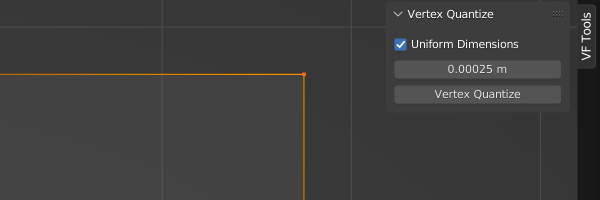
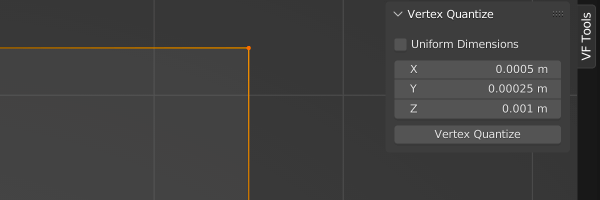

# VF Vertex Quantize

This add-on was designed for Blender version 2.8-4.1 (though not all previous versions may be fully supported). For Blender 4.2 and onwards, [please see the new Mesh Kit extension](https://github.com/jeinselen/Blender-MeshKit).

Snaps vertices to custom per-axis increments, for when Blender's grid snap isn't granular enough. Quantization can be applied outside of edit mode so long as vertices within the active object are selected.

## Installation and Usage
- Download [VF_vertexQuantize.py](https://raw.githubusercontent.com/jeinselenVF/VF-BlenderVertexQuantize/main/VF_vertexQuantize.py)
- Open Blender Preferences and navigate to the "Add-ons" tab
- Install and enable the Add-on
- It will show up in the 3D view `VF Tools` tab
- Default keyboard shortcut is `Shift + Q`

## Settings

- `Uniform Dimensions`
	- Switches between uniform and non-uniform dimensions
- `Uniform Value`
	- When uniform is enabled, this defines the quantization grid (this periodic distances vertices will be snapped to)
- `XYZ Values`
	- When uniform is disabled, three input fields define the quantization steps for each axis individually
- `Vertex Quantize`
	- Click this to snap vertices to the closest defined increments

## Known Limitations

- Does not work on objects with shape keys
- When multiple objects are selected, only the _active_ selected object is affected (does not support batch processing multiple models)
- Removing the shortcut key will prevent adding a new one later using the Blender UI (this may be a limitation of the Blender Python API, seems like plugin classes cannot have keyboard shortcuts added by default)